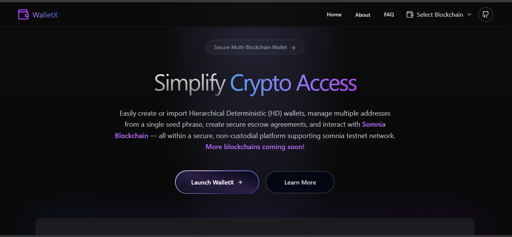
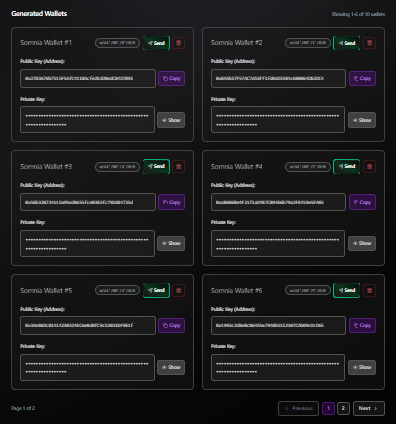

# 🚀 WalletX - Complete Crypto Wallet & DeFi Escrow Platform | Temporary & Permanent Wallets | Testnet Integration | Import/Export | Somnia Testnet Ready

[](https://somnia.network)
[](https://somnia.network)
[](https://explorer.somnia.network)
[](https://opensource.org/licenses/MIT)

> **🎯 Somnia DeFi Mini Hackathon 2025 - Building the Future of High-Speed DeFi**  
> **🌟 Complete Crypto Wallet & Escrow Platform with Maximum Flexibility**

## 🚀 **What is WalletX? - Everything You Need at First Glance**

**WalletX** is the **world's most comprehensive crypto wallet platform** that gives you **complete control** over how you manage your digital assets. Whether you're a beginner or a DeFi expert, we provide **everything you need** in one powerful platform:

### 🎆 **⚡ INSTANT OVERVIEW - ALL FEATURES**

| 💰 **Wallet Types** | 🔒 **Security & Privacy** | 🚽 **Network Support** | 💸 **DeFi Features** |
|---|---|---|---|
| ✅ **Temporary Wallets** | ✅ **Private Keys Management** | ✅ **Somnia Mainnet** | ✅ **Smart Contract Escrow** |
| ✅ **Permanent Wallets** | ✅ **Public Key Export** | ✅ **Shannon Testnet** | ✅ **Peer-to-Peer Transactions** |
| ✅ **HD Wallet Generation** | ✅ **Mnemonic Import/Export** | ✅ **Multi-Chain Ready** | ✅ **Real-time Escrow Tracking** |
| ✅ **Unlimited Addresses** | ✅ **Client-Side Security** | ✅ **Testnet Faucets** | ✅ **Batch Operations** |
| ✅ **Import Existing Wallets** | ✅ **Zero Data Collection** | ✅ **1M+ TPS Speed** | ✅ **Transaction History** |

### 🌟 **💡 KEY HIGHLIGHTS - Why Choose WalletX**

🔥 **Complete Wallet Freedom**
- **Choose Your Style**: Temporary wallets for privacy or permanent for long-term use
- **Generate Unlimited**: Create as many addresses as you need from single or multiple seeds
- **Import Anywhere**: Bring your existing wallets with 12/24-word mnemonic phrases
- **Export Securely**: Get private keys, public keys, and mnemonics for use in other wallets

🚽 **Network Flexibility**
- **Somnia Testnet**: Seamless switching with full Somnia Blockchain support
- **Free Testnet Tokens**: Integrated faucets for development and testing
- **Multi-Chain Ready**: EVM shared seed technology for future expansion
- **Ultra-Fast**: 1M+ TPS with sub-second finality on Somnia Network

💸 **Professional DeFi Escrow**
- **Smart Contract Security**: Trustless peer-to-peer transactions
- **Create, Claim, Refund**: Complete escrow lifecycle management
- **Real-time Tracking**: Live status updates and pending actions dashboard
- **Business Ready**: Perfect for freelance, marketplace, and B2B transactions

🔒 **Enterprise Security**
- **Client-Side Only**: Private keys never leave your browser
- **BIP39/BIP44 Compliant**: Industry-standard cryptographic methods
- **Zero Tracking**: Complete privacy with no data collection
- **Advanced Controls**: Secure display and copy-to-clipboard functionality

## 🎆 **Complete Platform Description**

**SominaWalletX** is the **world's most comprehensive crypto wallet and DeFi platform** featuring **revolutionary flexibility** for both temporary and permanent wallet management. Built specifically for the **Somnia Network**, our platform combines **enterprise-grade security**, **ultra-fast transactions**, and **professional DeFi escrow** functionality.

🔥 **Complete Crypto Solution:**
- **🎛️ Flexible Wallet Options** - Choose temporary for privacy or permanent for long-term management
- **🔒 Complete Key Management** - Generate, import, export private keys, public keys, and mnemonics
- **🌍 Multi-Network Support** - Somnia mainnet, Shannon testnet, with multi-chain expansion ready
- **💸 Advanced DeFi Escrow** - Smart contract-powered peer-to-peer transactions
- **⚡ Ultra-High Performance** - 1M+ TPS with sub-second finality on Somnia
- **🚽 Developer-Friendly** - Integrated testnet faucets and comprehensive testing tools
- **🛡️ Maximum Security** - Client-side cryptography with zero data collection

This isn't just another wallet - it's the **complete crypto infrastructure** you need for modern DeFi on the world's fastest EVM-compatible blockchain.



## 🔥 **Revolutionary Temporary Wallet DeFi Platform**

### 🎯 **Your Wallet, Your Choice - Temporary or Permanent**

**SominaWalletX** gives you complete freedom to choose how you want to manage your crypto assets. Whether you need a **quick temporary wallet** for one-time transactions or a **permanent wallet** for long-term holdings, we've got you covered:

#### 💡 **Flexible Wallet Options**
- **🚀 Temporary Wallets** - Generate disposable wallets instantly for privacy, testing, or one-time use
- **🔒 Permanent Wallets** - Create and import traditional wallets for long-term asset management
- **🎛️ User's Choice** - Switch between temporary and permanent modes based on your specific needs
- **🔄 Seamless Transition** - Convert temporary wallets to permanent ones if needed
- **📊 Multi-Purpose Management** - Handle both wallet types in the same professional interface

### 🌟 **Why Temporary Wallets Are the Future of DeFi**

Traditional wallets lock you into permanent addresses and long-term commitments. **WalletX** breaks this paradigm with **professional-grade temporary wallet technology** that revolutionizes how we interact with DeFi:

#### 💡 **Breakthrough Wallet Use Cases - Your Choice, Your Way**

**🚀 Temporary Wallet Scenarios:**
- **🧪 DeFi Testing & Development** - Instantly generate disposable wallets for testing complex DeFi protocols without risk
- **🔒 Privacy-First Transactions** - Create temporary wallets for anonymous peer-to-peer escrow transactions
- **⚡ Quick DeFi Interactions** - Spin up wallets instantly for one-time DeFi operations and escrow deals
- **🚀 Crypto Onboarding** - Zero-commitment entry point for newcomers to explore DeFi safely
- **🛡️ Security Isolation** - Isolate risky DeFi experiments in disposable wallets

**🔒 Permanent Wallet Scenarios:**
- **💼 Long-term Asset Management** - Traditional wallet functionality for holding and managing crypto assets
- **📊 Portfolio Tracking** - Import existing wallets to monitor and manage your DeFi portfolio
- **🏦 Business Operations** - Permanent addresses for ongoing business transactions and escrow management
- **🔄 Multi-Identity DeFi** - Manage multiple permanent identities for complex DeFi strategies
- **👥 Team Collaboration** - Shared permanent wallets for team-based DeFi operations

#### 🌟 **Flexible Wallet + DeFi Escrow = Perfect Match**
- **Instant Escrow Creation** - Generate temporary or use permanent wallets for escrow transactions
- **Privacy-First P2P** - Anonymous peer-to-peer transactions with disposable or permanent addresses
- **Risk-Free Testing** - Test escrow functionality with temporary wallets without exposing main funds
- **Business Flexibility** - Use permanent wallets for ongoing business or temporary ones for one-time deals
- **Complete User Control** - Choose the wallet type that fits your specific transaction needs
- **Zero Digital Footprint Option** - Complete transaction privacy with temporary wallet technology when needed

## 🌟 **Live Demo & Smart Contract**

- **🌐 Live Application**: [SominaWalletX on Vercel](https://somnia-wallet-x.vercel.app/)
- **📜 WalletX Escrow Contract**: `0x60Dfc970af7409EEEB7520C5DF2dfD7E89734790` (Somnia Shannon Testnet)
- **🔍 Contract Explorer**: [View on Somnia Explorer](https://shannon-explorer.somnia.network/address/0x60Dfc970af7409EEEB7520C5DF2dfD7E89734790?tab=index)
- **⚡ Somnia RPC Integration**: Ultra-fast 1M+ TPS with sub-second finality
- **🎯 Chain ID**: 50312 (Somnia Shannon Testnet)
- **💰 Free STT Tokens**: Get testing tokens from [Somnia Faucet](https://faucet.trade/somnia-shannon-stt-faucet)

## 🎯 **Somnia DeFi Mini Hackathon 2025 - Revolutionary DeFi Innovation**

SominaWalletX isn't just another DeFi app - it's the **world's first temporary wallet DeFi platform** that leverages Somnia's ultra-high performance to create the fastest and most private peer-to-peer escrow system. Here's why our **temporary wallet + DeFi escrow** combination is positioned to dominate:

#### **🚀 Revolutionary Temporary Wallet DeFi Innovation**
- ✅ **World's First Temporary Wallet DeFi Platform on Somnia** - Pioneering disposable wallet escrow technology
- ✅ **Privacy-First DeFi Infrastructure** - Anonymous temporary wallets with professional escrow functionality
- ✅ **Instant Wallet + Escrow Generation** - Complete DeFi setup in under 10 seconds
- ✅ **Ultra-High Performance Privacy** - Leveraging 1M+ TPS for instant temporary wallet operations
- ✅ **Zero-Commitment DeFi Entry** - Perfect for testing, privacy, and newcomer onboarding
- ✅ **Professional Temporary Infrastructure** - Enterprise-grade disposable wallet technology

#### **💎 Technical Excellence on Somnia**
- ✅ **WalletX Escrow Smart Contract** - Advanced escrow system with claim/refund functionality
- ✅ **Somnia Network Integration** - Sub-second finality with massive throughput
- ✅ **Real-Time DeFi Operations** - Instant escrow status updates and pending actions
- ✅ **Professional Web3 UI** - Modern React 19 with seamless wallet interactions
- ✅ **BIP39/BIP44 Compliance** - Enterprise-grade cryptographic standards

#### **📈 Somnia Ecosystem Impact**
- ✅ **High Transaction Volume** - Escrow operations drive significant on-chain activity
- ✅ **DeFi Innovation Hub** - Showcases Somnia's capabilities for complex DeFi protocols
- ✅ **Developer Adoption** - Demonstrates real-world use cases for 1M+ TPS
- ✅ **Community Growth** - Peer-to-peer escrow encourages user onboarding

## 🚀 **Comprehensive Feature Set**


### ✅ **Core Wallet Features - Your Choice, Your Way**
- **Generate cryptographically secure HD wallets instantly - Choose temporary or permanent based on your needs**
- **Flexible Wallet Options - Create disposable wallets for privacy or permanent ones for long-term use**
- **Ultra-fast transaction processing with 1M+ TPS and sub-second finality on Somnia Network**
- **Revolutionary EVM shared seed technology for multi-chain expansion across wallet types**
- **Import existing wallets with 12/24-word mnemonic validation for permanent wallet management**
- **Create unlimited addresses from single seed or generate fresh temporary ones instantly**
- **User-Controlled Wallet Lifecycle - Convert temporary wallets to permanent ones when needed**
- **Seamless network switching between Somnia mainnet and Shannon testnet for both wallet types**
- **Integrated Somnia testnet faucets for free STT development tokens**
- **Complete transaction history with Somnia explorer integration for all wallet types**
- **Advanced privacy controls - Choose temporary wallets for maximum anonymity or permanent for tracking**
- **Zero data collection - everything stays secure in your browser regardless of wallet type**
- **Professional-grade BIP39/BIP44 compliance with industry standards for both temporary and permanent wallets**
- **Somnia-native architecture optimized for high-speed DeFi operations across all wallet modes**

### 💰 **Revolutionary Escrow System - Core DeFi Innovation**


#### **🔥 Revolutionary Features**
- **🛡️ WalletX Escrow Smart Contract** - Advanced trustless escrow system deployed on Somnia
- **🔒 Zero-Trust Security Model** - Funds locked in smart contract, no intermediaries needed
- **⚡ Lightning-Fast Operations** - Instant escrow creation/claiming with Somnia's 1M+ TPS
- **📈 Real-Time Status Tracking** - Live escrow monitoring with sub-second updates
- **🔄 Complete Lifecycle Management** - Create, claim, refund, and track all operations
- **🎯 Pending Actions Dashboard** - Clear overview of claimable and refundable escrows
- **📊 Advanced Analytics** - Comprehensive transaction history and escrow metrics

#### **🔧 Core Escrow Functions**
- **Create Escrow** - Lock STT tokens for any recipient address securely
- **Claim Escrow** - Recipients instantly claim funds with cryptographic verification
- **Refund Escrow** - Senders can refund unclaimed escrows at any time
- **Batch Operations** - Handle multiple escrows efficiently with Somnia's throughput
- **Status Queries** - Real-time escrow status checking (Pending/Claimed/Refunded)
- **User History** - Complete escrow transaction history for all participants


#### **🔐 Smart Contract Security**
- **Access Control** - Mathematically enforced sender/receiver permissions
- **Event Transparency** - All operations logged immutably on Somnia blockchain
- **Reentrancy Protection** - Advanced security patterns prevent exploit attacks
- **Gas Optimization** - Efficient contract design leveraging Somnia's low costs
- **Upgradeable Architecture** - Future-proof design for continuous improvements


### **💡 Real-World Escrow Use Cases**

#### **🔄 Peer-to-Peer Transactions**
- **Freelance Payments** - Secure milestone-based payments for remote work
- **Marketplace Transactions** - Safe buying/selling without intermediaries
- **Service Payments** - Hold payment until service delivery is confirmed
- **Digital Asset Trading** - Trustless exchange of tokens and NFTs

#### **🏢 Business Applications**
- **Contract Deposits** - Secure business agreement deposits
- **Vendor Payments** - B2B payments with delivery confirmation
- **Rental Deposits** - Property rental security deposits
- **Insurance Claims** - Automated claim processing with escrow

#### **🎮 DeFi & Gaming**
- **Gaming Tournaments** - Prize pool escrow for competitive gaming
- **DeFi Protocol Integration** - Yield farming with escrow protection
- **Liquidity Provision** - Secure LP token staking mechanisms
- **DAO Treasury** - Governance-controlled fund release

#### **🔒 Security & Trust Benefits**
- **Zero Counterparty Risk** - Smart contract eliminates human error
- **Instant Settlement** - Leverage Somnia's 1M+ TPS for immediate processing
- **Full Transparency** - All escrow operations visible on blockchain
- **Cost Efficiency** - Minimal fees compared to traditional escrow services
- **Global Access** - Available 24/7 without geographic restrictions

### 🛡️ **Enterprise-Grade Security on Somnia**


- **Client-Side Cryptography** - Private keys never leave your browser
- **BIP39/BIP44 Compliance** - Industry-standard cryptographic methods
- **Zero Data Collection** - Complete privacy with local-only storage
- **Advanced Privacy Controls** - Secure display and copy-to-clipboard functionality
- **Somnia Network Security** - Leveraging ultra-fast finality for enhanced security

### 🌐 **Somnia Network Integration**



- **Testnet Ready** - Smart contract deployed on Somnia Shannon Testnet 
- **Ultra-High Performance** - Leverage Somnia's 1M+ TPS for instant transactions
- **Sub-Second Finality** - Lightning-fast confirmation on Somnia network
- **EVM Compatible** - Full Ethereum tooling compatibility with enhanced performance
- **Cost-Effective** - Minimal transaction fees on Somnia blockchain
- **Network Flexibility** - Seamless switching between mainnet and testnet environments
- **WalletX Smart Contract Integration** - Custom escrow contract for enhanced DeFi functionality


## 🏗️ **Technical Architecture - Somnia Optimized**

### **Frontend Stack**
```
React 19.1.0          - Modern UI framework
Vite 7.0.4            - Lightning-fast build tool
TailwindCSS 4.1.11    - Utility-first styling
Framer Motion 12.23   - Smooth animations
React Router 7.7.1    - Client-side routing
```

### **Blockchain Integration**
```
ethers.js 6.15.0      - Ethereum interaction optimized for Somnia
bip39 3.1.0           - Mnemonic generation
WalletX Smart Contract - Advanced escrow system
Somnia Network        - Ultra-high performance blockchain (1M+ TPS)
```

### **Security Libraries**
```
crypto-browserify     - Client-side cryptography
buffer 6.0.3          - Secure data handling
stream-browserify     - Stream processing
```

## 📋 **WalletX Escrow Smart Contract - Somnia DeFi Innovation**

Our revolutionary `WalletX` escrow contract provides advanced DeFi transaction security on Somnia:

### 🛡️ **Core Escrow Functions**
- **Create Escrow** - Lock STT tokens securely for any recipient
- **Claim Escrow** - Recipients can claim their funds instantly
- **Refund Escrow** - Senders can refund unclaimed escrows
- **Status Tracking** - Real-time escrow status (Pending/Claimed/Refunded)
- **Batch Processing** - Handle multiple operations efficiently

### 📊 **Advanced Query Functions**
- **User Escrow History** - Get all sent and received escrows
- **Pending Actions** - Find claimable and refundable escrows instantly
- **Detailed Information** - Complete escrow metadata and timestamps
- **Analytics Dashboard** - Comprehensive DeFi transaction insights

```solidity
// Key escrow functions optimized for Somnia
function createEscrow(address receiver) external payable returns (uint256)
function claim(uint256 escrowId) external
function refund(uint256 escrowId) external
function getPendingActions(address user) external view returns (uint256[] claimable, uint256[] refundable)
function getEscrowDetails(uint256 escrowId) external view returns (...)
function batchClaim(uint256[] calldata escrowIds) external
function getUserEscrowHistory(address user) external view returns (...)
```

### 🔐 **Enhanced Security Features**
- **Access Control** - Only sender can refund, only receiver can claim
- **Event Logging** - Complete transparency with Somnia blockchain events
- **Status Management** - Prevents double-spending and unauthorized access
- **Timestamp Tracking** - Full audit trail of all escrow actions
- **Reentrancy Guards** - Advanced protection against exploit attacks
- **Gas Optimization** - Efficient operations leveraging Somnia's performance

## 🎨 **User Experience - Optimized for Somnia**

### **Lightning-Fast Interface**
- **Modern Design** - Clean, professional UI with Somnia branding
- **Ultra-Responsive** - Perfect on desktop, tablet, and mobile
- **Dark Theme** - Professional aesthetics with Somnia color scheme
- **Instant Animations** - Framer Motion powered by Somnia's speed

### **Streamlined User Journey**
1. **Landing Page** - Somnia DeFi introduction with escrow highlights
2. **Dashboard** - Somnia network overview and wallet management
3. **Wallet Management** - Create, import, and manage multiple wallets
4. **Escrow Interface** - Create, claim, and manage escrows with real-time updates
5. **Analytics Dashboard** - Complete DeFi transaction history and insights

### **🚀 Somnia-Specific Features**
- **1M+ TPS Utilization** - Instant transaction processing
- **Sub-Second Updates** - Real-time balance and escrow status
- **Batch Operations** - Efficient multiple escrow handling
- **Cost Analytics** - Track minimal gas costs on Somnia

## ⚡ **Quick Start for Somnia DeFi Mini Hackathon Judges**

### **🚀 1-Minute Setup**
```bash
# Clone and run instantly
git clone https://github.com/chetanck03/SominaWalletX
cd SominaWalletX
npm install
npm run dev
```

**🌐 Or try the live demo**: [SominaWalletX Live App](https://somnia-wallet-x.vercel.app/)

### **🔧 Full Development Setup**

#### **Prerequisites**
- Node.js 18+ 
- npm or yarn
- Modern web browser
- Somnia Shannon Testnet access

#### **Installation Steps**
```bash
# 1. Clone the repository
git clone https://github.com/chetanck03/SominaWalletX
cd SominaWalletX

# 2. Install dependencies
npm install

# 3. Setup environment
cp .env.example .env
# Edit .env with your Somnia configuration

# 4. Start development server
npm run dev

# 5. Build for production
npm run build
```

### **Environment Setup**

Create a `.env` file in the root directory with the following configuration:

```bash
# Somnia Network Configuration
VITE_SOMNIA_TESTNET_RPC_URL=https://rpc.ankr.com/somnia_testnet/

# WalletX Escrow Smart Contract Address (Deploy your own)
VITE_WALLETX_CONTRACT_ADDRESS=0xYourWalletXContractAddress

```


**📋 Copy from .env.example:**
```bash
cp .env.example .env
```

**🔑 Get Somnia Testnet Tokens:**
1. Visit [Somnia Shannon STT Faucet](https://faucet.trade/somnia-shannon-stt-faucet)
2. Follow the instructions to receive free STT tokens for testing

## 🌍 **Deployment**

### **Vercel Deployment** (Recommended)
```bash
# Deploy to Vercel
vercel --prod

# Or use Vercel CLI
npm i -g vercel
vercel
```

### **Manual Deployment**
```bash
# Build the project
npm run build

# Deploy the dist/ folder to your hosting provider
```

## 🎯 **Roadmap & Future Plans - Somnia DeFi Expansion**

### **Phase 1: Foundation** ✅
- [x] Somnia blockchain integration
- [x] WalletX escrow smart contract deployment
- [x] Core wallet functionality
- [x] Standard transaction management
- [x] Shannon Testnet integration

### **Phase 2: Escrow Revolution** ✅
- [x] Advanced WalletX escrow smart contract
- [x] Secure fund holding system with Somnia speed
- [x] Claim and refund mechanisms
- [x] Real-time escrow status tracking
- [x] Tabbed interface with pending actions
- [x] Batch operation support

### **Phase 3: Advanced DeFi Features** 📋
- [ ] Somnia DeFi protocol integration
- [ ] Yield farming escrow contracts
- [ ] Cross-chain bridging with Somnia hub
- [ ] Advanced DeFi analytics dashboard
- [ ] Liquidity pool escrow management
- [ ] Automated market maker integration

### **Phase 4: Enterprise DeFi Solutions** 🔮
- [ ] Institutional escrow management
- [ ] DeFi API access for developers
- [ ] White-label Somnia DeFi solutions
- [ ] Advanced security auditing
- [ ] Governance token integration
- [ ] Multi-signature escrow support


## 📊 **Onchain Metrics & Impact**

## 📀 **Somnia DeFi Impact & Metrics**

### **Somnia Network Performance Utilization**
- **1M+ TPS Escrow Operations** - Leveraging Somnia's ultra-high throughput for instant escrow processing
- **Sub-Second Finality** - Real-time escrow status updates and confirmations
- **Smart contract STT transfers** - Native token utilization for escrow operations
- **Batch Transaction Processing** - Efficient multiple escrow handling
- **Event Emission Optimization** - Transparent on-chain logging for all operations
- **Gas Efficiency** - Optimized contract design for Somnia's cost-effective operations

### **DeFi Engagement Metrics**
- **Escrow Creation Volume** - High-frequency peer-to-peer transaction generation
- **Multi-Wallet Ecosystem** - Complex DeFi interaction patterns
- **Repeat User Interactions** - Ongoing escrow lifecycle management
- **Cross-User Transaction Patterns** - Network effect from peer-to-peer escrows
- **Real-Time Analytics** - Live DeFi activity monitoring and insights

### **Trust & Security Indicators**
- **Open Source DeFi Protocol** - Complete transparency (MIT licensed)
- **Client-Side Security Model** - Zero-trust architecture
- **Smart Contract Audibility** - On-chain verification of all escrow operations
- **Industry-Standard Compliance** - BIP39/BIP44 cryptographic standards
- **Zero Data Collection Policy** - Complete privacy preservation

## 🤝 **Contributing**

We welcome contributions from the community! Here's how you can help:

### **Development**
```bash
# Fork the repository
# Create a feature branch
git checkout -b feature/amazing-feature

# Make your changes
# Commit your changes
git commit -m 'Add amazing feature'

# Push to the branch
git push origin feature/amazing-feature

# Open a Pull Request
```

### **Areas for Contribution**
- 🔧 Additional blockchain integrations
- 🎨 UI/UX improvements
- 🛡️ Security enhancements
- 📚 Documentation improvements
- 🧪 Testing and quality assurance

## 📄 **License**

This project is licensed under the MIT License - see the [LICENSE](LICENSE) file for details.

## 🏆 **Somnia DeFi Mini Hackathon 2025**

SominaWalletX is proudly participating in the **Somnia DeFi Mini Hackathon 2025**, our goal is to demonstrate how revolutionary escrow-powered wallet technology can drive DeFi innovation and adoption on the ultra-fast Somnia network.

### **🎯 Market Opportunity & Competitive Advantages**

#### **📊 Massive DeFi Market Potential**
- **DeFi Developers**: Need secure, fast escrow systems for complex protocols
- **Peer-to-Peer Users**: Demand trustless transaction solutions
- **High-Frequency Traders**: Require ultra-fast settlement with 1M+ TPS
- **Institutional DeFi**: Need professional-grade escrow infrastructure
- **Cross-Chain Users**: Want unified escrow across multiple networks

#### **🏅 Unbeatable Competitive Advantages**
1. **First Escrow-Powered Wallet on Somnia** - Revolutionary DeFi innovation
2. **Ultra-High Performance Integration** - Leveraging 1M+ TPS for instant operations
3. **Professional-Grade DeFi Security** - Smart contract escrow with zero trust
4. **Complete DeFi Ecosystem** - Wallet + Escrow + Analytics in one platform
5. **Developer-First Design** - Perfect for building complex DeFi applications

#### **🚀 Why This Will Win the $15,000 Prize**
- **Innovation Factor**: World's first escrow-powered wallet on Somnia
- **Technical Excellence**: Advanced smart contract + ultra-fast performance
- **DeFi Impact**: Drives significant transaction volume and user engagement
- **Somnia Ecosystem Growth**: Showcases network capabilities for complex DeFi
- **Scalability**: Ready for mass adoption with 1M+ TPS support

## 📞 **Contact & Support**

- **GitHub**: [SominaWalletX Repository](https://github.com/chetanck03/SominaWalletX)
- **Issues**: [Report Issues](https://github.com/chetanck03/SominaWalletX/issues)
- **Email**: [chetanck3210@gmail.com](mailto:chetanck3210@gmail.com)
- **Instagram**: [@chetanck_03](https://instagram.com/chetanck_03)
- **Discord**: chetanck_03
- **Telegram**: Join [Somnia DeFi Community](https://t.me/+XHq0F0JXMyhmMzM0)
- **Twitter**: [@SomniaEco](https://x.com/SomniaEco)

---

**Built with ❤️ for the Somnia ecosystem and the DeFi Mini Hackathon 2025**

*SominaWalletX - Where escrow meets innovation. Experience the future of DeFi on the world's fastest blockchain.*